Un *Abstract Rewriting System* (ARS) è una coppia $(A, \to)$ t.c.
1. $A\neq \emptyset$ ed è chiamato *insieme degli stati* (o delle configurazioni).
2. $\to \subseteq A \times A$ ed è chiamata *relazione di transazione*.

- Nel caso $\lambda$ calcolo come ARS si ha $(\Pi, \to_\beta)$ con $\Pi=$ insieme dei $\lambda$ termini.
- Nel caso delle macchine di Turing $(A, Q, q_0, q_f, \delta)$ si può come vedere come ARS $(A^\mathbb{Z} \times \mathbb{Z} \times Q, \to)$.
- Nel caso di un generico linguaggio di programmazione funzionale si ha la medesima cosa del $\lambda$ calcolo.
- Nel caso di un generico linguaggio di programmazione imperativo si sceglie la configurazione in cui ha il linguaggio, che in questo caso, in base al suo livello (alto o basso), potrebbero essere le celle dei registri $(\mathbb{R} \times \mathbb{Z}^\mathbb{N}, \to)$ dove $\mathbb{Z}$ sono i registri, $\mathbb{Z}$ è la memoria, $\to$ è fetch-decode-execute; in quelli ad alto livello diviene più complesso perché bisogna considerare stack, heap, IP, IR, etc. 

> Dominio sopra e codominio sotto $(\mathbb{Z}^\mathbb{N})$.

Un ARS $(A, \to)$ è deterministico quando $\forall q_1, q_2, q_2^\prime \in A. q_1 \to q_2 \land q_1 \to q_2^\prime \implies q_2 = q_2^\prime$ 

Esempi deterministici:
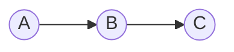

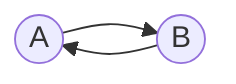

Esempi non deterministici. Un esempio sono i programmi concorrenti in cui, in base alla velocità, si avrà uno stato finale che può differire. 

Caso 1.
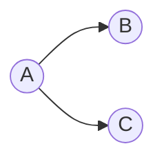

Caso 2.
Coppia critica, vi sono due cammini divergenti che però congiungono in un unico punto deterministico. Questa si chiama *confluenza*.
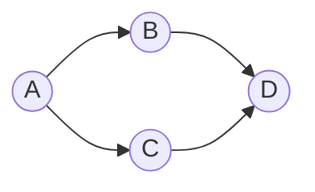

Caso 3.
Qui c'è anche il caso in cui si ha 1 solo stato possibile ma non è manco sempre raggiunto, quindi se il compilatore sbaglia a scegliere la biforcazione la prima volta, allora potrebbe non raggiungere mai la fine.
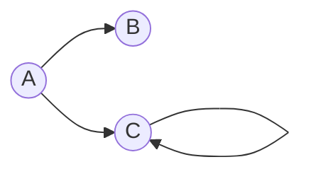

Caso 4.
Qui potrebbe non finire mai l'esecuzione però potrebbe anche finire nel caso di `C --> B` o `D --> B`.
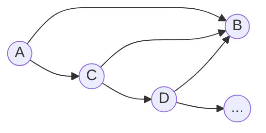


La scelta di lasciare al compilatore la scelta della semantica in modo dunque non deterministico è perché il compilatore si può adattare alle varie architetture.

## Tipi di confluenza

- Confluenza locale
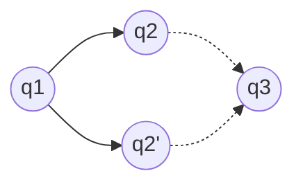

$\forall q_1, q_2, q_2^\prime. q_1 \to q_2 \land q_1 \to q_2^\prime$
$\exists q_3. q_2 \to q_3 \land q_2^\prime \to q_3$ 
Che è uguale a dire 
$\forall q_1, q_2, q_2^\prime. q_2 \leftarrow q_1 \to q_2^\prime \implies \exists q_3. q_2 \to q_3 \leftarrow q_2^\prime$

- Semiconfluenza
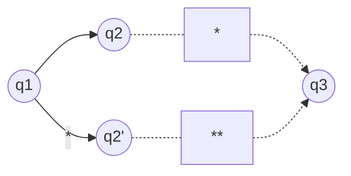
> `*` e `**` rappresentano la stessa cosa, però non me lo fa fare.

- Confluenza
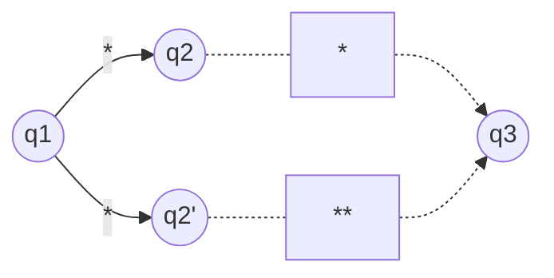

$$\text{Confluenza} \implies \text{Semiconfluenza} \implies \text{Confluenza locale}$$
$$\text{Confluenza locale} \;\not\!\!\!\implies \text{Semiconfluenza}$$

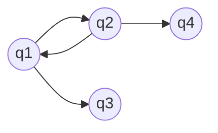
che può essere

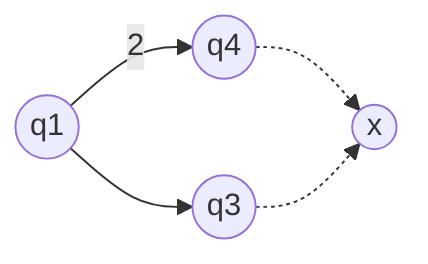

oppure
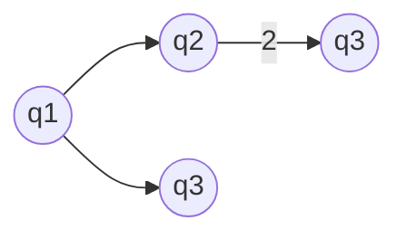


Il controesempio non è fortemente normalizzante.

**Teorema**
$$\text{Fortemente normalizzate} \land \text{Confluente locale} \implies \text{Semiconfluente}$$

*Dimostrazione (errata) di Confluenza locale => Semiconfluenza*
Caso 0 passi.
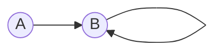

Caso $n+1$ passi.
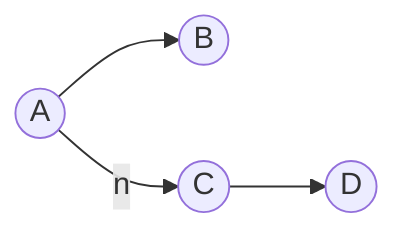
Per ipotesi induttiva vi è uno stato tra $B$ e $C$ in cui si va per un numero determinato di passi. La chiusura del grafo però è possibile? Cioè, esiste un modo per avere 
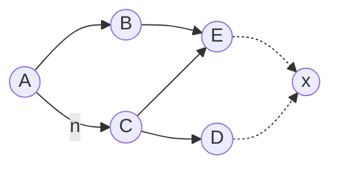
? No.

**Teorema**
$$\text{Semiconfluenza} \implies \text{Confluenza}$$

Caso 0.
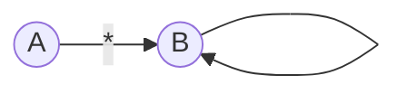

Caso $n+1$.


L'ipotesi induttiva mi dice che
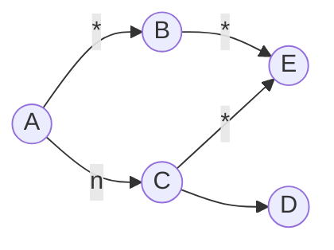
e che quindi si chiude.
`aggiornare da slide`

**Teorema**
$$\text{Confluenza} \implies \text{Unicità delle forme normali}$$
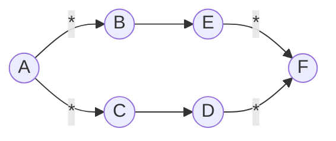

ma in realtà i passi da `E->F` e `D->F` sono $0$ e dunque i nodi `E` e `D` sono uguali!
Se ci sono strade alternative arrivano alla stessa forma normale.

**Teorema**
$$\text{Confluenza} \implies \text{Safety}$$
**Definizione di** $\text{Safety}$
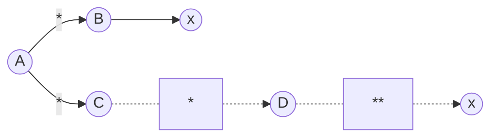
Ovvero si assume di aver fatto un certo numero di passi per arrivare alla forma normale.

*Dimostrazione*
```mermaid
graph LR
	A((A)) --*--> B((B))
	B((B)) --> X((x))
	B((B)) --*--> F((F))
	A((A)) --*--> C((C))
	C((C)) --*--> F((F))
```
Ma in realtà `B->F` e `C->F` fanno $0$ passi  e dunque `B=C`.

**Teorema**
Il $\lambda$ calcolo è semiconfluente.
```mermaid
graph LR
	A((A)) --*--> B
	A((A)) --> C((C))
	B((B)) --*--> D((D))
	C((C)) --*--> D((D))
```

### Fonti del non determinismo
1. Un redex ha due ridotti: non avviene nel $\lambda$ calcolo, ma nei linguaggi potrebbe. Ad esempio `flip()` può essere sostituita da `0` o `1`.

![[fondamenti-logici-informatica/appunti/santo/static/untitled-2023-09-27-1503.png|300]]

2. Due redex possono essere overlapping ma non uno strettamente incluso nell'altro: non avviene nel $\lambda$ calcolo.

![[untitled-2023-09-27-1503-1.png|300]]

3. Redex non overlapping o paralleli: c'è nel $\lambda$ calcolo.

![[untitled-2023-09-27-1503-2.png|300]]

4. Un redex interamente contenuto nell'altro: c'è nel $\lambda$ calcolo. (Di solito si perde confluenza)

![[untitled-2023-09-27-1503-3.png|300]]

Ad esempio si può decidere cosa tornare in base a quale parte dell'espressione si fa prima il parsing.
![[static/Untitled-2023-09-27-1503 7.png]]

#### Caso 4 nel $\lambda$ calcolo
1. Con $x \notin FV(M)$ si ha
![[untitled-2023-09-27-1503-4.png|500]]
Ma con la call-by-value si rischia di divergere quando non necessario.

2. Con $x \in FV(M)$ si ha
![[static/Untitled-2023-09-27-1503 5.png|500]]
La call-by-value è la strada più corta.

3. Usando il lemma
Se $M \to_\beta N$ allora $M[R/x] \to_\beta N[R/x]$
![[untitled-2023-09-27-1503-6.png|500]]

