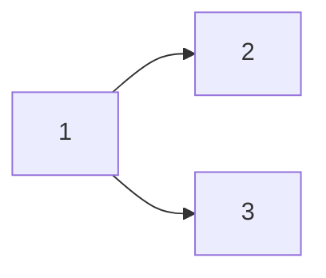
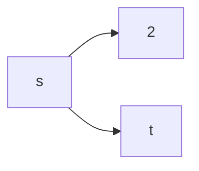

Il concetto di problema computazionale è correlato alla soluzione di una funzione. Dato come assunzione che dominio e codominio siano stringhe binarie perché qualsiasi altra struttura è codificata in binario, si pososno avere, ad esempio:

- Numeri $\mathbb{N}$
$$34 \mapsto 10010 =: \lfloor 34 \rfloor$$
- Tuple
$$\langle x,y \rangle \mapsto \lfloor x\rfloor \# \lfloor y\rfloor \mapsto$$
questo si ha facendo "parsing" disambiguando dove e quando inizia prima/seconda stringa, eg $0 \mapsto 00, 1 \mapsto 11, \# \mapsto 01$.
- Grafi
Si fanno matrice di adiacenze, la quale è una tupla di tupla.

Dunque queste funzioni esprimono un determinato predicato perché definite come $f: \mathbb{B} \to \{0, 1\}$ in cui è falso / vero. Si può vedere questa funzione come sotto insieme delle stringhe per $f$ per cui è uguale a $1$, ed esso è chiamato *linguaggio*.
$$\mathscr{L} \in \mathbb{B}$$
$$\mathscr{L}_f = \{b \in \mathbb{B} | f(b) = 1\}$$

Il problema è che non si ha idea di come venga ispezionato il grafo o il perché venga ad un valore della funzione venga assegnato $1$. Questa è detta visione estensionale (o dichiarativa) perché si fa riferimento al fattore insiemistico. Si descrive un problema, non un algoritmo per la risoluzione di tale problema.

Bisogna pensare $f$ dividendola in determinati passi usando trasformazioni $\mathop \to ^ \mathcal{A}$. Diciamo che $\mathcal{A}$ calcola $f$ e la sua semantica $[\![\mathcal{A}]\!] = f$. 
Si usa il tempo per misurare i passi elementari. Si astrae il tempo di calcolo perché bisogna creare una teoria, cancellando dunque dettagli, eliminando i secondi in 'sto caso. Il tempo impiegato su tale algoritmo con un dato input $x$ è $\text{TIME}_\mathcal{A}(x)$.
Nello spazio si contano il numero di passi che occorrono in memoria: su un dato input $x$ si calcola come $\text{SPACE}_\mathcal{A}(x)$. Non si fa una somma di tutte le celle ma solo quelle necessarie da un passo all'altro, cancellando e/o scrivendoci sopra. Non si conta lo spazio per l'input e l'output della funzione.

Le classi concrete che ne derivano si basano in base agli algoritmi che vengono usati per tali linguaggi. Presa una funzione $g : \mathbb{N} \to \mathbb{N}$ si definisco delle classi concrete (sono insiemi di linguaggi):
$$\text{DTIME}(g)=\{L \subseteq \mathbb{B} | \exists A.[\![\mathcal{A}]\!]=L \land \forall x. \text{TIME}_\mathcal{A}(x) \leq g(|x|)\}$$
$$\text{DSPACE}(g)=\{L \subseteq \mathbb{B} | \exists A.[\![\mathcal{A}]\!]=L \land \forall x. \text{SPACE}_\mathcal{A}(x) \leq g(|x|)\}$$

Mentre le classi di complessità:
$$P = \bigcup_{g \in \text{POLY}} \text{DTIME}(g)$$
Se è in $P$ vuol dire che si risolve efficientemente. Se un algoritmo in $P$ va più veloce in un altro computer, resta comunque in $P$.
$\text{DTIME}(g) \neq O(g)$ però ci si può arrivare considerando che $g$ può essere sufficientemente grande.

$$\text{PSPACE} = \bigcup_{g \in \text{POLY}} \text{DSPACE}(g)$$
$$L = \bigcup_{g \in \text{LOGA}} \text{DSPACE}(g)$$

Ahimè sono ristretti ad una funzione $g$ ma è una descrizione troppo precisa che restringe e dunque si estende un po' usando la classe polinomiale $\text{POLY}$ (quindi in maniera efficiente con buone proprietà). $\text{PSPACE}$ non è ottimale, però rimane buona in alcuni contesti. $\text{L}$ è efficiente.

La "D" sta a significare che è deterministica.

Se una funzione non è deterministica si definisce $f(x)=1$ se esiste almeno un nodo nel cammino tale che abbia questo valore. Se si ha che l'algoritmo porta a tale risultato dciamo che $\mathcal{A}$ decide $f$.

$$\text{NDTIME}(g) = \{L \subseteq \mathbb{B} | \exists \mathcal{A}\text{ non deterministico}. [\![\mathcal{A}]\!]=L \land \forall x. \text{TIME}_\mathcal{A}(x) \leq g(|x|)\}$$
$$NP = \bigcup_{g \in \text{POLY}} \text{NDTIME}(g)$$

La classe $NP$ dei linguaggi $L$ per cui si può creare una data computazione che dice se è accettabile o meno, tutto in tempo polinomiale. Verificare è più semplice di creare.

$$L \subseteq P \subseteq NP \subseteq \text{PSPACE}$$
$$L \subset \text{PSPACE}$$

## Complessità descrittiva
Applicato al caso d'esempio sui grafi si può creare un predicato $E(x,y)$ nel vocabolario della logica descrittiva che ritorna $1$ nel caso esista un arco che va da $x$ a $y$.

*Esempio*
$\mathcal{A}_3 = \{1,2,3\}$
$v = \{E(-, -), =(-, -), s, t\}$
$$I: \begin{equation}\begin{cases}
E \mapsto \{(1,2), (1, 3)\}\\
= \mapsto \{(1,1), (2,2), (3,3)\}\\
s \mapsto 1\\
t \mapsto 3
\end{cases}\end{equation}$$
$(\mathcal{A}_3, I) \models \exists x. E(s,x)$

che si può vedere anche come

questa struttura è data dalla teoria dei modelli.

$(\mathcal{A}_n, I) \models \phi$
$\mathscr{L}_\phi = \{(\mathcal{A}_n, I) | (\mathcal{A}_n, I) \models \phi\}$
Tupla di insieme + interpretazione non è proprio semplice, dunque si possono esprimere come stringhe binarie.

### Interpretazioni di stringhe
Prendiamo un generico vocabolario fatto da $m$ simboli di predicati $P$ e $k$ simboli di funzione $f$ . Una qualunque interpretazione è data da stringa $\text{bin}^n(I) \in \mathbb{B}$ dove
$$\text{bin}^n(I) = \text{bin}^n(P_1)\cdots\text{bin}^n(P_m)\text{bin}^n(f_1)\cdots\text{bin}^n(f_k)$$
la stringa binaria è composta in modo tale che il carattere è $1$ se la tupla $i$-esima fa parte dell'interpretazione.
La stringa associata a $P_i$ ha lunghezza $n^{ar(P_i)}$ e $ar(P_i)$ è l'arietà (numero di argomenti). Specifica se la tupla fa parte di $(P_i)_I$.
La stringa associata a $f_i$ sarà la sua interpretazione espressa come stringa binaria e dunque con lunghezza a $\lceil\log_2(n)\rceil$ (qual è l'elemento di $\mathcal{A}_n$).
Si chiama $\text{bin}^n$ perché è parametrica. Serve per fare il parsing della stringa.

Prendiamo ad esempio
$\mathcal{A}_3 = \{1,2,3\}$
$$I: \begin{equation}\begin{cases}E \mapsto \{(1,2)(1,3)\}\\ s \mapsto 1\\ t \mapsto 3\end{cases}\end{equation}$$

Tutte le tuple di $\mathcal{A}_3$ lunghe 2 è data da $n=3, ar(E) = 2$
$|\text{bin}^3(E)| = 3^2 = 9$

> Con ordine lessico-grafico: ordine in cui posso sempre ordinare le tuple.
> $\text{bin}^3(E) = \{(1,1), (1,2),(1,3),(2,1),(2,2),(2,3),(3,1),(3,2),(3,3)\}$
 
$\text{bin}^3(E) = 011000000$

$\text{bin}^3(s) = \lceil\log(3)\rceil=2$
$\text{bin}^3(s) = 01$
$\text{bin}^3(t) = 11$
$\text{bin}^3(I) = 0110000000111$

### Formule
Si usano formule chiuse. Nel momento in cui si prendono variabili bisogna avere sue interpretazioni. Le formule sono chiuse perché non vi sono variabili libere. Ad ogni formula chiusa si può prendere un linguaggio. Con la formula $F$ si ha
$$\text{struct}(F) = \{\text{bin}^n(I) | (\mathcal{A}_n, I) \models F\} \subseteq \mathbb{B}$$
La logica può essere vista come insieme di linguaggi. Bisogna capire se esiste una logica a tali spazi.

### Logica predicativa
$FO$ = logica predicativa chiusa.
$$FO = \{\text{struct}(F) | F \text{ è formula predicativa chiusa}\}$$
I problemi usati nella logica del primo ordine sono molto efficienti.
$$FO \subseteq L$$
Anche se da teorema si ha che
$$FO \subset L$$
Si ha un'estensione del primo + secondo ordine.
$$F::= \dots | X^n(t_1, \dots, t_n) | \exists X^n.F|\forall X^n.F$$
Stiamo considerando solo formule aperte, dunque bisogna interpretare le formule usando un appoggio, con $\xi$ che si occupa di queste relazioni.

$$(\mathcal{A}, I), \xi \models X^n(t_1, \dots, t_n)\text{ sse } ([\![t_1]\!]_\xi^{(\mathcal{A}, I)}, \dots,[\![t_n]\!]_\xi^{(\mathcal{A}, I)}) \in \xi(X^n)$$
$$(\mathcal{A}, I), \xi \models \exists X^n.F\text{ sse } (\mathcal{A}, I), \xi[X^n := \mathcal{R}] \models F\hspace{2em}\text{per qualche } \mathcal{R} \subseteq \mathcal{A}^n$$
$$(\mathcal{A}, I), \xi \models \forall X^n.F\text{ sse } (\mathcal{A}, I), \xi[X^n := \mathcal{R}] \models F\hspace{2em}\text{per tutte } \mathcal{R} \subseteq \mathcal{A}^n$$

Preso ad esempio per il primo ordine
$F = \exists x.(P(x) \lor P(y))$
Prendo $\xi$ perché mi serve sapere su cos'è mappato $y$. Variabili del primo ordine -> elementi su $\mathcal{A}$. 
$(\mathcal{A}, I), \xi^? \models F$

Preso ad esempio per il secondo ordine
$G = \exists x.(P(x) \lor X(x))$
Prendo $\xi$ perché mi serve sapere su cos'è mappato $X(x)$. Variabili del secondo ordine -> relazioni su $\mathcal{A}$. 
$(\mathcal{A}, I), \xi^? \models G$

La variabile è libera però, perché se avessi
$G = \forall X. \exists x.(P(x) \lor X(x))$
bisogna capire come rendere vero tutta la formula, guardando tutte le possibili interpretazioni. Ci si appoggia comunque per quando si guarda la semantica.

### Raggiungibilità di un grafo
È una proprietà che risponde se un grafo è collegato dai nodi $s$ e $t$. Preso universo e interpretazione $(\mathcal{A}, I)$ con $I$ fatto da $E(-, -), s, t$.
$$\text{struct}(\psi_{s,t})=\{\text{bin}^n(I) | (\mathcal{A}_n, I) \text{ è un grafo dove }t\text{ è raggiungibile da }s\}$$
Non si può esprimere con la logica del primo ordine perché manca un livello di espressività per vedere insiemi di nodi. Dunque si può fare

$$\psi_{s,t}= \exists R^\star (s = t \lor (\phi_L \land \phi_E \land \phi_F))$$
$$\phi_L = \forall u. \neg R^\star(u,u) \land \forall v \forall w.R^\star(u,v) \land R^\star(v, w) \implies R^\star(u,w)$$
$$\phi_E=\forall u\forall v.(R^\star(u,v) \land \forall w.(\neg R^\star(u, w) \land \neg R^\star(w, v))) \implies E(u,v)$$
$$\phi_F=\forall u. \neg R^\star(u, s) \land \neg R^\star(t, u) \land R^\star(s,t)$$
Se c'è un cappio tra $s$ e $t$ la raggiungibilità è triviale. $\phi_F$ viene usato perché $s$ e $t$ devono essere, rispettivamente, primo e ultimo per forza nella catena: così viene caratterizzata la catena più piccola.

## Teorema di Fagin e logica del secondo ordine esistenziale
Un problema è in $NP$ sse quel problema è definito mediante formula del secondo ordine esistenziale.
$$\exists SO = \{\text{struct}(F) | F \text{ è una formula
al second'ordine esistenziale}\}$$
$$\exists SO = NP$$
Le variabili appaiono in $F$ dove è nel primo ordine, e questo è chiamata logica al secondo ordine esistenziale.
$\exists X^{n_1}.\dots .\exists X^{n_m}.F$

Esempio (non sono del secondo ordine esistenziale)
$\forall x. \forall X. (X(x))$
$\forall x. \exists X. (X(x))$

Esempio (buono)
$\exists X. \forall x.X(x)$

Questo teorema non dà soluzioni per quanto riguarda $P$. Si può scrivere un nuovo predicato per l'esempio del grafo sopra come
$$E^\star(x,y) \equiv x=y \lor \exists z. (E(x,z) \land E^\star(z,y))$$
ed è il "più piccolo" perché $E^\star$ appare sia a destra che a sinistra e dunque questa definizione è accettabile sotto alcune condizioni, in cui $E^\star$ a destra dev'essere più piccolo.
I punti fissi vengono usati per avere la logica più espressiva su $P$. Il minimo punto fisso della funzione $F$ è definito come $\mu F$.
Se esiste $F(y)=y$ allora $\mu F \leq y$. Dato un insieme $X$ si considera il $\mathcal{P}(X)$.

$X^m$ è positiva se ogni $X^m$ in $F$ è in un ambito pari di negazioni.

*Esempio*
$F = \forall y.(X^m(x_1, \dots, x_m) \lor P(y))$ lo è perché le negazioni sono $=0$
$F = \forall y.(\neg X^m(x_1, \dots, x_m) \lor P(y))$ non lo è perché le negazioni sono $=1$

Per ogni $X^m$ positiva si può associare un funzionale
$$F^I = \mathcal{P}(\mathcal{A}^m_n) \to \mathcal{P}(A_n^m)$$
e quindi una funzione che associa insiemi di tuple ad insiemi di tuple.

$$D \longmapsto \{(a_1, \dots, a_m) \in \mathcal{A}_n^m | (\mathcal{A}_n, I), \xi \models F \text{ t.c. } \xi(X^m)=D \land \xi(x_i) =a_i\}$$

Se la formula è positiva allora $F^I$ è monotono, ovvero, dati $y$ e $z$, $y \leq z \implies F(y) \leq F(z)$. La monotonia costituisce sicurezza nel trovare $\mu F$.

### Teorema di Knaster-Tarski
Se $F:A \to A$ è monotono, allora ha un punto fisso.

$$\mu F ::= \bigcap \{ Y | F(Y) \subseteq Y \}$$
che è uguale a
$$\mu F ::= \bigcup \{ Y | Y \subseteq F(Y) \}$$

dato che stiamo considerando l'insieme delle parti, allora si può considerare in modo più specifico.

Se $F:\mathcal{P}(\mathcal{A}) \to \mathcal{P}(\mathcal{A})$ è monotono, allora ha un punto fisso.

$$\mu F::= \bigcup_n F^n(\emptyset) = \emptyset \cup F(\emptyset) \cup F(F(\emptyset)) \cup F(F(F(\emptyset))) \cup F^n(\emptyset) = F^{n+1}(\emptyset)$$

*Dimostrazione* $\mu F ::= \bigcap \{ Y | F(Y) \subseteq Y \}$
1. $\mu F = F(\mu F)$
2. Se $Y$ è tale che $Y = F(Y)$ allora $\mu F \subseteq Y$
si dimostra che sono inclusi fra di loro e in quel caso allora avremmo eguaglianza.
1. $\forall Y \in \{Y | F(Y) \subseteq Y\}, \mu F \subseteq Y \implies F(\mu F) \subseteq F(Y)$ per monotonicità.
   Allora $F(\mu F) \subseteq F(Y) \subseteq Y$
   Allora $F(\mu F) \subseteq \cap \{Y | F(Y) \subseteq Y\}$ ma la seconda parte è $\mu F$ dunque è come fare $F(\mu F) \subseteq \mu F$
   Allora, per monotonicità, $FF(\mu F) \subseteq F(\mu F)$ 
   quindi $F(\mu F) \in \{Y | F(Y) \subseteq Y\}$
   allora $\cup \{Y | F(Y) \subseteq Y\} \subseteq F(\mu F) = \mu F$
2. Se $Z = F(Z)$ allora $F(Z)\subseteq Z$
   quindi $Z \in \{Y | F(Y) \subseteq Y\}$
   allora $\cup \{Y | F(Y) \subseteq Y\} \subseteq Z = \mu F$
   

La forma $LFP(X^m, x_1, \dots, x_m, F)$ dove si ha una formula $F$ di tipo $X^m$ positiva e un numero di variabili libere del primo ordine, rappresenta una logica chiamata del punto fisso molto espressiva.

*Esempio del primo ordine*
$$F = \forall y.(X(y)\lor X(z))$$

*Logica del punto fisso*
$$G = LFP(X, z, F)$$

non si prende $y$ perché è legata. Minimo punto fisso della variabile $X$ in $F$ della variabile libera $z$.

$$FO (LFP) = \{\text{struct}(F) | F \text{ è formula predicativa con minimi punti fissi}\}$$

### Teorema di Immerman-Vardi
$$FO(LFP)=P$$
La logica del primo ordine è troppo semplice per la complessità computazionale.
La logica del secondo ordine è troppo espressiva per la complessità computazionale.

$$P = NP \text{ sse } FO(LFP) = \exists SO$$
